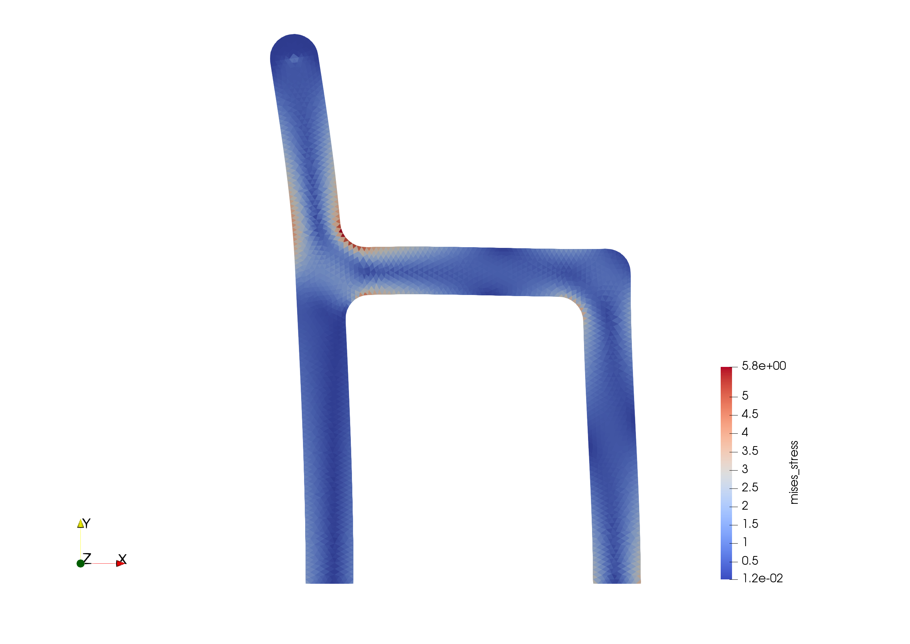

# minimalFEM-VTK

is a simple FEM code.  
This code is based on [MinimalFEM](https://github.com/podgorskiy/MinimalFEM/)([Tutorial](http://podgorskiy.com/spblog/304/writing-a-fem-solver-in-less-the-180-lines-of-code)), so this code is also MIT license.  

# usage

1 command "make" in minimalFEM-VTK/
```
make -j
```

2 execute with the below command  
```
./minimalFEM.out input/test1.inp output/test1.vtk
```

3 You can see the result in [paraview](https://www.paraview.org/)

exmple test3

